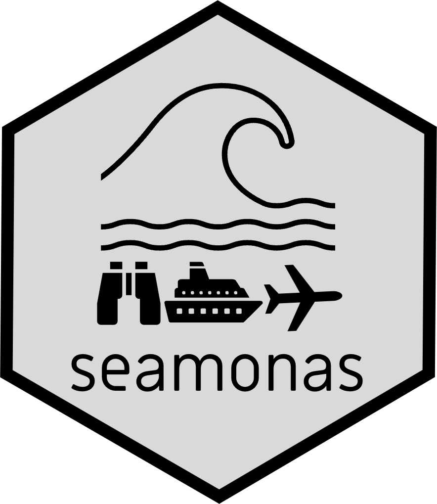

<!-- README.md is generated from README.Rmd. Please edit that file -->

```{r, include = FALSE}
knitr::opts_chunk$set(
  collapse = TRUE,
  comment = "#>",
  fig.path = "man/figures/README-",
  out.width = "100%"
)
```

# seamonas 

<!-- badges: start -->
<!-- badges: end -->

**seamonas** provides easy access to information based on guidelines for monitoring seabirds at sea. 
It includes detailed table content and a sample dataset to support implementation.
Information based on the HELCOM Monitoring Guidelines for Seabirds at Sea [ESAS database](https://helcom.fi/wp-content/uploads/2021/11/HELCOM-Monitoring-guidelines-for-seabirds-at-sea-monitoring.pdf).

## About

**seamonas** contains:

- A **list of 549 species** across morphological separated groups.
- Harmonized **column names** and guidance for completing each entry.
- Unified **descriptions** for field entries, includes abiotic structures, activity codes, associations.
- One **trip example** from a monitoring containing basic trip information.  
- One **survey example** from a monitoring containing survey information. 
- One survey example from a monitoring containing **species detected and specifications**. 


## Installation

You can install the development version of seamonas from [GitHub](https://github.com/) with:

```{r, eval=FALSE, warning=FALSE}
devtools::install_github("MiriamLL/seamonas")
```

## Start

Load the package

```{r}
library(seamonas)
```

## Euring

`seamonas` contains:  
- A list of **549** species names across morphological separated groups.

```{r}
head(Code_Euring)
```

**Key fields**: 

- `Code`: Numerical code based on [Euring](https://euring.org/data-and-codes/euring-codes). The species codes are primarily based on the EURING list, with additional 'uncertainty codes' commonly used by ESAS partners to represent species groups that are often difficult to identify under at-sea field conditions.<br> 
- `Scientific_name`: A scientific name is the standardized, universally accepted name used to identify and classify living organisms. It follows a system called binomial nomenclature.<br> 
- `English_name`: Official common name of the species.<br>
- `Artificial_tax_class`: A custom classification system based on taxonomic and morphological similarities among species.<br>

## Explanations

`seamonas` contains:  
- Harmonized **column names** and guidance for completing each entry.

```{r}
data(Column_Descriptions)
```

### Examples of use

```{r, message=FALSE, warning=FALSE}
library(tidyverse)
```

```{r}
seamonas::Column_Descriptions %>%
  select(starts_with('Trip'))%>%
  drop_na()%>%
  filter(Trip_Name=='DATE')
```

## Descriptions  

`seamonas` contains:  
- Unified **descriptions** for field entries, includes abiotic structures, activity codes, associations.

```{r}
data(Code_Descriptions)
```

### Examples of use

```{r, message=FALSE, warning=FALSE}
library(tidyverse)
```

```{r}
seamonas::Code_Descriptions %>%
  select(starts_with('ACT'))%>%
  drop_na()
```

## Trip

`seamonas` contains:  
- One **trip example** from a monitoring containing basic trip information.  

```{r}
data(Trip_test)
```

**Field descriptions**: 

- `TRIP`: Used for descriptions of the columns. <br>
- `TRIP_ID`: Sequential number of each survey day and any change in relevant fields. <br>
- `Dataset_ID`: Numerical identifier of the dataset in the database.<br> 
- `CRUISENO`: Unique code identifying the survey. <br>
- `OWPAS`: Identifier for the contracting authority.  <br>
- `PROJECT`: Identifier for the project. <br>
- `CLUSTER`: Identifier for the cluster or study area. <br>
- `LAB`: Name of the company conducting the survey. <br>
- `SCIENTIST`: Name of the responsible scientist at the surveying company. <br>
- `DATATYPE`: Type of data collected (e.g., Seabird Monitoring). <br>
- `TECHNIQUE`: Survey method used (e.g., video or still camera for digital surveys). <br>
- `OBSERVER`: Identifier of the surveyor or aircraft operator. <br>
- `PLANE`: Identifier of the aircraft used. <br>
- `NUMBER_OF_PLANES`: Number of planes used in the survey. <br>
- `DOUBLE_PLATFORM`: Define if survey include parallel flights ('Yes'or 'No'). <br>
- `DATE`: Survey date in YYYYMMDD format.<br>
- `STARTTIME`: Time of start of survey in hh:mm:ss format.<br>
- `STARTTIME`: Time of the end of the survey in hh:mm:ss format.<br>
- `CAMERA_SYSTEM`: Description of the camera system used. <br>
- `RESOLUTION`: Numerical value of the resolution at sea surface.<br>
- `PLANE_FLIGHT_HEIGHT_PLANNED`: Numerical value of planned flight altitude. <br>
- `STRIP_WIDHT`: Numerical value of the width of the survey strip. <br>
- `PLANE_SPEED`: Numerical value for speed of the aircraft during the survey . <br>
- `POSITION_ACCURACY`: Mean deviation between recorded image position and actual GPS position. <br>
- `METHOD_ID`: Numerical value to define if the survey was made by 1= Transect or 2 = Grid. <br>
- `AREA_OBSERVED`: Numerical value of the area observed before processing the images. <br>
- `AREA_ANALYSED`: Numerical value of the area analysed after processing the images. <br>
- `AREA_CONTROLLED`: Numerical value of the area that was controlled during the screening. <br>
- `ID_CONTROLLED`: Numerical value of the total number of controlled objects. <br>
- `SCREENING_CONTROL_DIFFERENCE`: Percentage of the difference between screening and control. <br>
- `ID_CONTROL_DIFFERENCE`: Percentage of the difference between initial identification and audit. <br>
- `QUALITY_IMPROVEMENT`: Description of any quality improvement actions taken. <br>
- `POSITIONSYSTEM`: Specification of the positioning system used. <br>
- `POSIT_PRECISION_CODE`: Positional accuracy: 1 = decimal degree with 1 decimal place, 2 = decimal degree with 2 decimal places, 3 = decimal degree with 3 decimal places, and so on. <br>
- `REFSYSTEM`: Geodetic reference system used. <br>
- `NOTES`: Additional information not covered in previous fields.<br>

### Example of use

```{r}
seamonas::Trip_test %>%
  select(LAB)
```

## Basis

`seamonas` contains:  
- One **survey example** from a monitoring containing survey information. 

```{r}
data(Basis_test)
```

**Field descriptions**: 

- `POSITIONS`: Can be used for descriptions of the columns. <br>
- `POSITION_ID`: Unique numeric identifier used to link data between "Basis" and "Observations". <br>
- `POSITION_ID_CONTROLLED`: Numerical codes specifying if an image was controlled during screening. Includes values 1 to 3. Controlled during screening control (1), controlled during id control (2) and controlled both during screening and id control (3). <br>
- `Dataset_ID`: Numerical identifier of the dataset in the database.<br> 
- `TRIP_ID`: Sequential number representing each survey day and any change in relevant fields. <br>
- `CRUISENO`: Unique identifier for the survey. <br>
- `CAMERA_NUMBER`: Identifier for the camera used. <br>
- `TRANSECT_NUMBER`: Sequential number representing transect number, if the survey was conducted along transects.<br>
- `DATE`: Date of the survey in YYYYMMDD format. <br>
- `TIME`: Time of the image recording in hh:mm:ss format. <br>
- `LAT_PIC_CENTER`: Latitude of the image center, recorded in WGS 84 decimal degrees (six decimal places). <br>
- `LON_PIC_CENTER`: Longitude of the image center, recorded in WGS 84 decimal degrees (six decimal places). <br>
- `PLANE_FLIGHT_HEIGHT`: Recorded flight height of the aircraft at the time of image capture (in meters, ±10 m accuracy). <br>
- `PIC_AREA_ANALYSED`: Surface area of the image. Some variation is expected.<br>
- `GLARE`: Numerical codes specifying sun glare intensity on the image, recorded at regular intervals Values expected are 0 = No glare; 1 = Low glare; 2 = Medium glare; 3 = Strong glare.  <br>
- `SEASTATE`: Numerical codes specifying sea state  on the image, recorded at regular intervals. Values expected are 0 to 7. <br>
- `TURBIDITY`: Numerical codes specifying water turbidity level based on visibility into the water, recorded at regular intervals. Values expected are 1 = No turbidity, 2 = Medium turbidity, 3 = Strong turbidity. <br>
- `ICE`: Numerical codes specifying ice coverage, recorded at regular intervals.<br>
- `CLARITY`: Numerical codes specifying air clarity, recorded at regular intervals. Values expected are 0 = not recorded, 1 = Low clarity, 2 = Medium clarity, 3 = High clarity. Some variation is expected. <br>
- `PIC_QUALITY`: Numerical codes specifying quality of the image, recorded at regular intervals. Values expected are 1 = Good quality, 2 = Bad quality. <br>
- `PIC_FILENAME`: File name that allows to link information with image. Example: A_20250616_ID30_6340_Common_Guillemot_c1_m1.png (Area_Date_PositionID_Code_Species_Camera_Modification). <br>
- `NOTES`: Additional information not covered in previous fields.<br>

### Example of use

```{r}
seamonas::Basis_test %>%
  summarise(GLARE_max=max(GLARE))
```

## Observations
`seamonas` contains:  
- One survey example from a monitoring containing **species detected and specifications**. 

```{r}
data(Observations_test)
```

**Field descriptions**: 

- `OBSERVATIONS`: Can be used for descriptions of the columns.<br>
- `Observation_ID`: Sequential number of each observation.<br> 
- `POSITION_ID`: Unique numeric identifier used to link data between "Basis" and "Observations". <br>
- `Dataset_ID`: Numerical identifier of the dataset in the database.<br> 
- `CRUISENO`: Unique identifier for the survey. <br>
- `ABIOTIC_STRUCTURES`: Numerical codes specifying physical abiotic features. Includes ships and infrastructures such as wind farms.<br>
- `ABIOTIC_OBSERVATIONS`: Numerical codes specifying abiotic non-living observations. Includes garbage, fishing lines, or any floating objects that are not animals (e.g., seaweed).<br>
- `OBSERVATION`: Numerical codes specifying the Euring code for every animal observation. <br>
- `ENGLISH_NAME_BEFORE_CONTROL`: English name assigned during initial identification.  <br>
- `ENGLISH_NAME_CONTROL_ID`: English name assigned during identification audit. <br>
- `ID_MATCH_MISMATCH`: Numerical codes specifying identification consistency between initial identifier and auditor: match (1) or mismatch (2).<br>
- `ENGLISH_NAME`: English name assigned by the referee, corresponding to the Euring code.<br> 
- `DETECTION_STEP`: Numerical codes specifying the detection stage: initial screening (1), control screening (2), both initial and control screening (3), initial identification, (4) audited identification (5).<br>
- `BEHAVIOUR`: Numerical codes specifying animal behavior, e.g., holding fish, dipping, kleptoparasitizing.<br>
- `ACTIVITY`: Numerical codes specifying animal activity, such as: swimming (1), flying (2), submerged (3), breaching surface (4), associated with platform (5). For abiotic observations and astructures undeclared (0) can be used. <br>
- `GROUP`: Consecutively numbered groups; all members of a group share the same number.<br>
- `FAMILY_GROUP`: Groups consisting of adults and juveniles sharing the same number. Examples: Harbour porpoise with calf, Common guillemots with fledglings.<br>
- `ASSOCIATIONS`: Numerical codes specifying animal associations with other animals or abiotic structures. Examples include Multi-species feeding associations (MSFA).<br>
- `HEADING`: Absolute movement direction of the animal in numeric compass bearings at 45° intervals (e.g., 0°, 45°, 90°, etc.).<br>
- `SUBMERGED`: Specification of the animal’s position relative to the water surface: breaching (o), below the surface (u) or unclear (x).<br> 
- `AGE_CLASS`: Specification of the age category of the animal: adult (A) or immature (IM). May also include molting (x) or not molting (y).<br>
- `AGE_YEAR`: Numerical codes specifying the calendar year from 1 to 7.<br>
- `PLUMAGE`: Specification of the plumage type includes breeding (B), winter (W), and morphs.<br>
- `SEX`: Specification of the sex of the animal. Includes female (F) or male (M).<br>
- `LENGTH`: Linear body length measured from the tip of the beak to the tip of the tail in numerical.<br>
- `WING_SPAN`: Measurement across the full spread of the wings in numerical.<br>
- `FLIGHT_HEIGHT`: Approximate height of flight in flying birds.<br>
- `FLIGHT_HEIGHT_CONFIDENCE`: Confidence interval of height of flight in flying birds.<br> 
- `FLIGHT_HEIGHT_METHOD_ID`: Numerical codes specifying the method for estimation of height of flight in flying birds. Categories include Parallax method (1), or calculated based on body size (2).<br> 
- `LAT_OBJECT`: Latitude of the observation in exact coordinates recorded in WGS 84 format with six decimal places. <br> 
- `LON_OBJECT`: Longitude of the observation in exact coordinates recorded in WGS 84 format with six decimal places.<br> 
- `NOTES`: Additional information not covered in previous fields.<br>

### Example of use

```{r}
seamonas::Observations_test %>%
  drop_na(ENGLISH_NAME)%>%
  group_by(ENGLISH_NAME)%>%
  tally()%>%
  arrange(desc(n))%>%
  head(3)
```

## Citation

If you use **seamonas** for your research, please consider citing this package. 

Lerma M (2025). Package seamonas. Access guidelines information for monitoring seabirds at sea. https://github.com/MiriamLL/seamonas

Additional references:

Kotzerka, J., Markones, N., Dierschke, V., & Auniņš, A. (2021). Guidelines for monitoring seabirds at sea. In Helsinki Commission.  https://helcom.fi/wp-content/uploads/2021/11/HELCOM-Monitoring-guidelines-for-seabirds-at-sea-monitoring.pdf


```{r,echo=FALSE,eval=FALSE}
save(Basis_test, file="Basis_test.rda", compress = "xz")
save(Code_Euring, file="Code_Euring.rda", compress = "xz")
save(Observations_test, file="Observations_test.rda", compress = "xz")
```

