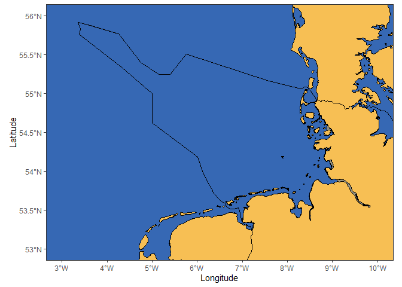

<!-- README.md is generated from README.Rmd. Please edit that file -->

# seamonas

<!-- badges: start -->
<!-- badges: end -->

The goal of seamonas is to provide tools to make plots of the North Sea
\## Installation

You can install the development version of seamonas from
[GitHub](https://github.com/) with:

``` r
# install.packages("devtools")
devtools::install_github("MiriamLL/seamonas")
```

## Example

This is a basic example which shows you how to solve a common problem:

``` r
library(seamonas)
```

## Convert points to sf

``` r
library(GermanNorthSea)
library(sf)
#> Linking to GEOS 3.9.3, GDAL 3.5.2, PROJ 8.2.1; sf_use_s2() is TRUE
```

``` r
Alemania<- st_transform(GermanNorthSea::Germany, 4326)
Europa<-st_transform(GermanNorthSea::German_land, 4326)
EEZ<-st_transform(GermanNorthSea::German_EEZ, 4326)
```

### Base Map

``` r
library(ggplot2)
```

``` r
load_basemap<-function(){
  BaseMap<-ggplot() +
      geom_sf(data = EEZ, colour = 'black', fill = 'transparent')+
      geom_sf(data = Alemania, colour = 'black', fill = '#f7bf54', alpha=0.5)+
      geom_sf(data = Europa, colour = 'black', fill = '#f7bf54')+
    xlab('Longitude')+ylab('Latitude')+ 
    theme_bw()+
    theme(legend.text=element_text(size=10),
        legend.position='none')+ 
    theme(
    panel.grid.major = element_blank(),
    panel.grid.minor = element_blank(),
    panel.background = element_rect(fill = '#3668b4'))+
  
    coord_sf(xlim = c(3, 10),ylim = c(53, 56))+
    scale_x_continuous(labels = function(x) paste0(x, '\u00B0', "W")) +
    scale_y_continuous(labels = function(x) paste0(x, '\u00B0', "N"))
  return(BaseMap)}
BaseMap<-load_basemap()
BaseMap
```


