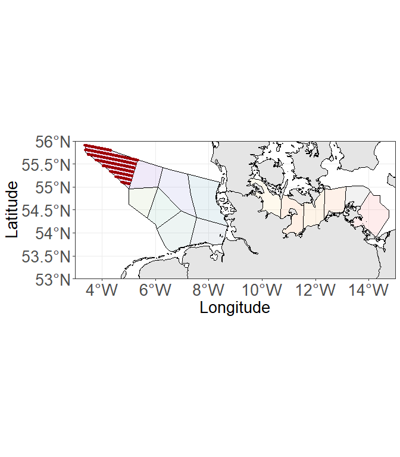
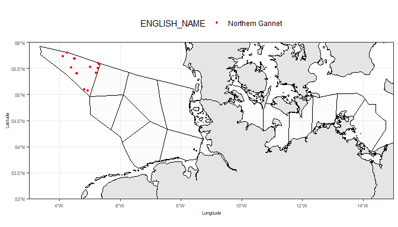
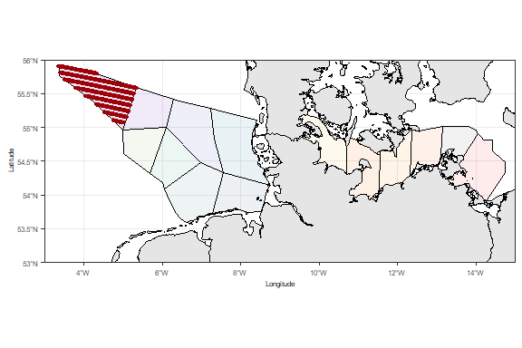
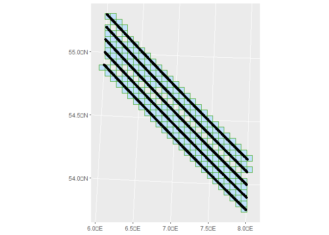

<!-- README.md is generated from README.Rmd. Please edit that file -->

# seamonas

<!-- badges: start -->
<!-- badges: end -->

The goal of seamonas is to provide tools to make plots of the North Sea

# 1. Intro

Contains:

-   Data from a random generated survey in CRS 3035 and CRS 4326  
-   A grid generated using the function create_grid in CRS 3035

# 2. Installation

You can install the development version of seamonas from
[GitHub](https://github.com/) with:

``` r
# install.packages("devtools")
devtools::install_github("MiriamLL/seamonas")
```

``` r
library('seamonas')
```

# 3. Data

``` r
head(survey_4326)
#>    seq survey_id longitude latitude          timestamps year month day
#> 1 1601         1  6.000000 55.10000 2018-04-01 09:00:00 2018    04  01
#> 2 1602         1  6.005013 55.09724 2018-04-01 09:01:00 2018    04  01
#> 3 1603         1  6.010025 55.09449 2018-04-01 09:02:00 2018    04  01
#> 4 1604         1  6.015038 55.09173 2018-04-01 09:03:00 2018    04  01
#> 5 1605         1  6.020050 55.08897 2018-04-01 09:04:00 2018    04  01
#> 6 1606         1  6.025063 55.08622 2018-04-01 09:05:00 2018    04  01
#>         date
#> 1 2018-04-01
#> 2 2018-04-01
#> 3 2018-04-01
#> 4 2018-04-01
#> 5 2018-04-01
#> 6 2018-04-01
```

## 3.1. Survey data

``` r
survey_4326<-survey_4326
```

``` r
ggplot2::ggplot()+
    ggplot2::geom_point(data=survey_4326,
                        ggplot2::aes(x=longitude, y= latitude, color=date),size = 1, shape = 16) 
```


Other data included:

``` r
grid5x5_3035
grid_surveyed
density_survey
```

# 4. Survey grid

## 4.1. transform_survey

If you collected latitude and longitude in degrees, transform from 4326
to 3035

``` r
survey_3035<-transform_survey(survey_data=survey_4326,
                 column_latitude='latitude',
                 column_longitude='longitude',
                 from_CRS=4326,
                 to_CRS=3035)
```

## 4.2. subset_grid

Add values to geometries of the grid, each square is a geometry or
polygon There will be warning that variables are assumed to be spatially
constant throughout all geometries Will print a plot and return the
grids with data

## 4.3. plot to check grid

# 5. Densities grid

## 5.1. load data

``` r
grid_surveyed<-grid_surveyed
density_survey<-density_survey
```

## 5.2. transform_survey

``` r
densities_3035<-transform_survey(survey_data=density_survey, 
                 column_latitude='latitude',
                 column_longitude='longitude',
                 from_CRS=4326,
                 to_CRS=3035)
```

## 5.3. grid_densities

``` r
density_grid<-subset_density(density_survey=densities_3035,
                             column_density='densities',
                             survey_grid=grid_surveyed,
                             grid_identifier='grid_id')
#> Warning: attribute variables are assumed to be spatially constant throughout
#> all geometries
#> Warning in mean.default(column_density): argument is not numeric or logical:
#> returning NA

#> Warning in mean.default(column_density): argument is not numeric or logical:
#> returning NA

#> Warning in mean.default(column_density): argument is not numeric or logical:
#> returning NA

#> Warning in mean.default(column_density): argument is not numeric or logical:
#> returning NA

#> Warning in mean.default(column_density): argument is not numeric or logical:
#> returning NA

#> Warning in mean.default(column_density): argument is not numeric or logical:
#> returning NA

#> Warning in mean.default(column_density): argument is not numeric or logical:
#> returning NA

#> Warning in mean.default(column_density): argument is not numeric or logical:
#> returning NA

#> Warning in mean.default(column_density): argument is not numeric or logical:
#> returning NA

#> Warning in mean.default(column_density): argument is not numeric or logical:
#> returning NA

#> Warning in mean.default(column_density): argument is not numeric or logical:
#> returning NA

#> Warning in mean.default(column_density): argument is not numeric or logical:
#> returning NA

#> Warning in mean.default(column_density): argument is not numeric or logical:
#> returning NA

#> Warning in mean.default(column_density): argument is not numeric or logical:
#> returning NA

#> Warning in mean.default(column_density): argument is not numeric or logical:
#> returning NA

#> Warning in mean.default(column_density): argument is not numeric or logical:
#> returning NA

#> Warning in mean.default(column_density): argument is not numeric or logical:
#> returning NA

#> Warning in mean.default(column_density): argument is not numeric or logical:
#> returning NA

#> Warning in mean.default(column_density): argument is not numeric or logical:
#> returning NA

#> Warning in mean.default(column_density): argument is not numeric or logical:
#> returning NA

#> Warning in mean.default(column_density): argument is not numeric or logical:
#> returning NA

#> Warning in mean.default(column_density): argument is not numeric or logical:
#> returning NA

#> Warning in mean.default(column_density): argument is not numeric or logical:
#> returning NA

#> Warning in mean.default(column_density): argument is not numeric or logical:
#> returning NA

#> Warning in mean.default(column_density): argument is not numeric or logical:
#> returning NA

#> Warning in mean.default(column_density): argument is not numeric or logical:
#> returning NA

#> Warning in mean.default(column_density): argument is not numeric or logical:
#> returning NA

#> Warning in mean.default(column_density): argument is not numeric or logical:
#> returning NA

#> Warning in mean.default(column_density): argument is not numeric or logical:
#> returning NA

#> Warning in mean.default(column_density): argument is not numeric or logical:
#> returning NA

#> Warning in mean.default(column_density): argument is not numeric or logical:
#> returning NA

#> Warning in mean.default(column_density): argument is not numeric or logical:
#> returning NA

#> Warning in mean.default(column_density): argument is not numeric or logical:
#> returning NA

#> Warning in mean.default(column_density): argument is not numeric or logical:
#> returning NA

#> Warning in mean.default(column_density): argument is not numeric or logical:
#> returning NA

#> Warning in mean.default(column_density): argument is not numeric or logical:
#> returning NA

#> Warning in mean.default(column_density): argument is not numeric or logical:
#> returning NA

#> Warning in mean.default(column_density): argument is not numeric or logical:
#> returning NA

#> Warning in mean.default(column_density): argument is not numeric or logical:
#> returning NA

#> Warning in mean.default(column_density): argument is not numeric or logical:
#> returning NA

#> Warning in mean.default(column_density): argument is not numeric or logical:
#> returning NA

#> Warning in mean.default(column_density): argument is not numeric or logical:
#> returning NA

#> Warning in mean.default(column_density): argument is not numeric or logical:
#> returning NA

#> Warning in mean.default(column_density): argument is not numeric or logical:
#> returning NA

#> Warning in mean.default(column_density): argument is not numeric or logical:
#> returning NA

#> Warning in mean.default(column_density): argument is not numeric or logical:
#> returning NA

#> Warning in mean.default(column_density): argument is not numeric or logical:
#> returning NA

#> Warning in mean.default(column_density): argument is not numeric or logical:
#> returning NA

#> Warning in mean.default(column_density): argument is not numeric or logical:
#> returning NA

#> Warning in mean.default(column_density): argument is not numeric or logical:
#> returning NA

#> Warning in mean.default(column_density): argument is not numeric or logical:
#> returning NA

#> Warning in mean.default(column_density): argument is not numeric or logical:
#> returning NA

#> Warning in mean.default(column_density): argument is not numeric or logical:
#> returning NA

#> Warning in mean.default(column_density): argument is not numeric or logical:
#> returning NA

#> Warning in mean.default(column_density): argument is not numeric or logical:
#> returning NA

#> Warning in mean.default(column_density): argument is not numeric or logical:
#> returning NA

#> Warning in mean.default(column_density): argument is not numeric or logical:
#> returning NA

#> Warning in mean.default(column_density): argument is not numeric or logical:
#> returning NA

#> Warning in mean.default(column_density): argument is not numeric or logical:
#> returning NA

#> Warning in mean.default(column_density): argument is not numeric or logical:
#> returning NA

#> Warning in mean.default(column_density): argument is not numeric or logical:
#> returning NA

#> Warning in mean.default(column_density): argument is not numeric or logical:
#> returning NA

#> Warning in mean.default(column_density): argument is not numeric or logical:
#> returning NA

#> Warning in mean.default(column_density): argument is not numeric or logical:
#> returning NA

#> Warning in mean.default(column_density): argument is not numeric or logical:
#> returning NA

#> Warning in mean.default(column_density): argument is not numeric or logical:
#> returning NA

#> Warning in mean.default(column_density): argument is not numeric or logical:
#> returning NA

#> Warning in mean.default(column_density): argument is not numeric or logical:
#> returning NA

#> Warning in mean.default(column_density): argument is not numeric or logical:
#> returning NA

#> Warning in mean.default(column_density): argument is not numeric or logical:
#> returning NA

#> Warning in mean.default(column_density): argument is not numeric or logical:
#> returning NA

#> Warning in mean.default(column_density): argument is not numeric or logical:
#> returning NA

#> Warning in mean.default(column_density): argument is not numeric or logical:
#> returning NA

#> Warning in mean.default(column_density): argument is not numeric or logical:
#> returning NA

#> Warning in mean.default(column_density): argument is not numeric or logical:
#> returning NA

#> Warning in mean.default(column_density): argument is not numeric or logical:
#> returning NA

#> Warning in mean.default(column_density): argument is not numeric or logical:
#> returning NA

#> Warning in mean.default(column_density): argument is not numeric or logical:
#> returning NA

#> Warning in mean.default(column_density): argument is not numeric or logical:
#> returning NA

#> Warning in mean.default(column_density): argument is not numeric or logical:
#> returning NA

#> Warning in mean.default(column_density): argument is not numeric or logical:
#> returning NA

#> Warning in mean.default(column_density): argument is not numeric or logical:
#> returning NA

#> Warning in mean.default(column_density): argument is not numeric or logical:
#> returning NA

#> Warning in mean.default(column_density): argument is not numeric or logical:
#> returning NA

#> Warning in mean.default(column_density): argument is not numeric or logical:
#> returning NA

#> Warning in mean.default(column_density): argument is not numeric or logical:
#> returning NA

#> Warning in mean.default(column_density): argument is not numeric or logical:
#> returning NA

#> Warning in mean.default(column_density): argument is not numeric or logical:
#> returning NA

#> Warning in mean.default(column_density): argument is not numeric or logical:
#> returning NA

#> Warning in mean.default(column_density): argument is not numeric or logical:
#> returning NA

#> Warning in mean.default(column_density): argument is not numeric or logical:
#> returning NA

#> Warning in mean.default(column_density): argument is not numeric or logical:
#> returning NA

#> Warning in mean.default(column_density): argument is not numeric or logical:
#> returning NA

#> Warning in mean.default(column_density): argument is not numeric or logical:
#> returning NA

#> Warning in mean.default(column_density): argument is not numeric or logical:
#> returning NA

#> Warning in mean.default(column_density): argument is not numeric or logical:
#> returning NA

#> Warning in mean.default(column_density): argument is not numeric or logical:
#> returning NA

#> Warning in mean.default(column_density): argument is not numeric or logical:
#> returning NA

#> Warning in mean.default(column_density): argument is not numeric or logical:
#> returning NA

#> Warning in mean.default(column_density): argument is not numeric or logical:
#> returning NA

#> Warning in mean.default(column_density): argument is not numeric or logical:
#> returning NA

#> Warning in mean.default(column_density): argument is not numeric or logical:
#> returning NA

#> Warning in mean.default(column_density): argument is not numeric or logical:
#> returning NA

#> Warning in mean.default(column_density): argument is not numeric or logical:
#> returning NA

#> Warning in mean.default(column_density): argument is not numeric or logical:
#> returning NA

#> Warning in mean.default(column_density): argument is not numeric or logical:
#> returning NA

#> Warning in mean.default(column_density): argument is not numeric or logical:
#> returning NA

#> Warning in mean.default(column_density): argument is not numeric or logical:
#> returning NA

#> Warning in mean.default(column_density): argument is not numeric or logical:
#> returning NA

#> Warning in mean.default(column_density): argument is not numeric or logical:
#> returning NA

#> Warning in mean.default(column_density): argument is not numeric or logical:
#> returning NA

#> Warning in mean.default(column_density): argument is not numeric or logical:
#> returning NA

#> Warning in mean.default(column_density): argument is not numeric or logical:
#> returning NA

#> Warning in mean.default(column_density): argument is not numeric or logical:
#> returning NA

#> Warning in mean.default(column_density): argument is not numeric or logical:
#> returning NA

#> Warning in mean.default(column_density): argument is not numeric or logical:
#> returning NA

#> Warning in mean.default(column_density): argument is not numeric or logical:
#> returning NA

#> Warning in mean.default(column_density): argument is not numeric or logical:
#> returning NA

#> Warning in mean.default(column_density): argument is not numeric or logical:
#> returning NA

#> Warning in mean.default(column_density): argument is not numeric or logical:
#> returning NA

#> Warning in mean.default(column_density): argument is not numeric or logical:
#> returning NA

#> Warning in mean.default(column_density): argument is not numeric or logical:
#> returning NA

#> Warning in mean.default(column_density): argument is not numeric or logical:
#> returning NA

#> Warning in mean.default(column_density): argument is not numeric or logical:
#> returning NA

#> Warning in mean.default(column_density): argument is not numeric or logical:
#> returning NA

#> Warning in mean.default(column_density): argument is not numeric or logical:
#> returning NA

#> Warning in mean.default(column_density): argument is not numeric or logical:
#> returning NA

#> Warning in mean.default(column_density): argument is not numeric or logical:
#> returning NA

#> Warning in mean.default(column_density): argument is not numeric or logical:
#> returning NA

#> Warning in mean.default(column_density): argument is not numeric or logical:
#> returning NA

#> Warning in mean.default(column_density): argument is not numeric or logical:
#> returning NA

#> Warning in mean.default(column_density): argument is not numeric or logical:
#> returning NA

#> Warning in mean.default(column_density): argument is not numeric or logical:
#> returning NA

#> Warning in mean.default(column_density): argument is not numeric or logical:
#> returning NA

#> Warning in mean.default(column_density): argument is not numeric or logical:
#> returning NA

#> Warning in mean.default(column_density): argument is not numeric or logical:
#> returning NA

#> Warning in mean.default(column_density): argument is not numeric or logical:
#> returning NA

#> Warning in mean.default(column_density): argument is not numeric or logical:
#> returning NA

#> Warning in mean.default(column_density): argument is not numeric or logical:
#> returning NA

#> Warning in mean.default(column_density): argument is not numeric or logical:
#> returning NA

#> Warning in mean.default(column_density): argument is not numeric or logical:
#> returning NA

#> Warning in mean.default(column_density): argument is not numeric or logical:
#> returning NA

#> Warning in mean.default(column_density): argument is not numeric or logical:
#> returning NA

#> Warning in mean.default(column_density): argument is not numeric or logical:
#> returning NA

#> Warning in mean.default(column_density): argument is not numeric or logical:
#> returning NA

#> Warning in mean.default(column_density): argument is not numeric or logical:
#> returning NA

#> Warning in mean.default(column_density): argument is not numeric or logical:
#> returning NA

#> Warning in mean.default(column_density): argument is not numeric or logical:
#> returning NA

#> Warning in mean.default(column_density): argument is not numeric or logical:
#> returning NA

#> Warning in mean.default(column_density): argument is not numeric or logical:
#> returning NA

#> Warning in mean.default(column_density): argument is not numeric or logical:
#> returning NA

#> Warning in mean.default(column_density): argument is not numeric or logical:
#> returning NA

#> Warning in mean.default(column_density): argument is not numeric or logical:
#> returning NA

#> Warning in mean.default(column_density): argument is not numeric or logical:
#> returning NA

#> Warning in mean.default(column_density): argument is not numeric or logical:
#> returning NA

#> Warning in mean.default(column_density): argument is not numeric or logical:
#> returning NA

#> Warning in mean.default(column_density): argument is not numeric or logical:
#> returning NA

#> Warning in mean.default(column_density): argument is not numeric or logical:
#> returning NA

#> Warning in mean.default(column_density): argument is not numeric or logical:
#> returning NA

#> Warning in mean.default(column_density): argument is not numeric or logical:
#> returning NA

#> Warning in mean.default(column_density): argument is not numeric or logical:
#> returning NA

#> Warning in mean.default(column_density): argument is not numeric or logical:
#> returning NA

#> Warning in mean.default(column_density): argument is not numeric or logical:
#> returning NA

#> Warning in mean.default(column_density): argument is not numeric or logical:
#> returning NA

#> Warning in mean.default(column_density): argument is not numeric or logical:
#> returning NA

#> Warning in mean.default(column_density): argument is not numeric or logical:
#> returning NA

#> Warning in mean.default(column_density): argument is not numeric or logical:
#> returning NA

#> Warning in mean.default(column_density): argument is not numeric or logical:
#> returning NA

#> Warning in mean.default(column_density): argument is not numeric or logical:
#> returning NA

#> Warning in mean.default(column_density): argument is not numeric or logical:
#> returning NA

#> Warning in mean.default(column_density): argument is not numeric or logical:
#> returning NA

#> Warning in mean.default(column_density): argument is not numeric or logical:
#> returning NA

#> Warning in mean.default(column_density): argument is not numeric or logical:
#> returning NA

#> Warning in mean.default(column_density): argument is not numeric or logical:
#> returning NA

#> Warning in mean.default(column_density): argument is not numeric or logical:
#> returning NA

#> Warning in mean.default(column_density): argument is not numeric or logical:
#> returning NA

#> Warning in mean.default(column_density): argument is not numeric or logical:
#> returning NA

#> Warning in mean.default(column_density): argument is not numeric or logical:
#> returning NA

#> Warning in mean.default(column_density): argument is not numeric or logical:
#> returning NA

#> Warning in mean.default(column_density): argument is not numeric or logical:
#> returning NA

#> Warning in mean.default(column_density): argument is not numeric or logical:
#> returning NA

#> Warning in mean.default(column_density): argument is not numeric or logical:
#> returning NA

#> Warning in mean.default(column_density): argument is not numeric or logical:
#> returning NA

#> Warning in mean.default(column_density): argument is not numeric or logical:
#> returning NA

#> Warning in mean.default(column_density): argument is not numeric or logical:
#> returning NA

#> Warning in mean.default(column_density): argument is not numeric or logical:
#> returning NA

#> Warning in mean.default(column_density): argument is not numeric or logical:
#> returning NA

#> Warning in mean.default(column_density): argument is not numeric or logical:
#> returning NA

#> Warning in mean.default(column_density): argument is not numeric or logical:
#> returning NA

#> Warning in mean.default(column_density): argument is not numeric or logical:
#> returning NA

#> Warning in mean.default(column_density): argument is not numeric or logical:
#> returning NA

#> Warning in mean.default(column_density): argument is not numeric or logical:
#> returning NA

#> Warning in mean.default(column_density): argument is not numeric or logical:
#> returning NA

#> Warning in mean.default(column_density): argument is not numeric or logical:
#> returning NA

#> Warning in mean.default(column_density): argument is not numeric or logical:
#> returning NA

#> Warning in mean.default(column_density): argument is not numeric or logical:
#> returning NA

#> Warning in mean.default(column_density): argument is not numeric or logical:
#> returning NA

#> Warning in mean.default(column_density): argument is not numeric or logical:
#> returning NA

#> Warning in mean.default(column_density): argument is not numeric or logical:
#> returning NA

#> Warning in mean.default(column_density): argument is not numeric or logical:
#> returning NA

#> Warning in mean.default(column_density): argument is not numeric or logical:
#> returning NA

#> Warning in mean.default(column_density): argument is not numeric or logical:
#> returning NA

#> Warning in mean.default(column_density): argument is not numeric or logical:
#> returning NA

#> Warning in mean.default(column_density): argument is not numeric or logical:
#> returning NA

#> Warning in mean.default(column_density): argument is not numeric or logical:
#> returning NA

#> Warning in mean.default(column_density): argument is not numeric or logical:
#> returning NA

#> Warning in mean.default(column_density): argument is not numeric or logical:
#> returning NA

#> Warning in mean.default(column_density): argument is not numeric or logical:
#> returning NA

#> Warning in mean.default(column_density): argument is not numeric or logical:
#> returning NA

#> Warning in mean.default(column_density): argument is not numeric or logical:
#> returning NA

#> Warning in mean.default(column_density): argument is not numeric or logical:
#> returning NA

#> Warning in mean.default(column_density): argument is not numeric or logical:
#> returning NA

#> Warning in mean.default(column_density): argument is not numeric or logical:
#> returning NA

#> Warning in mean.default(column_density): argument is not numeric or logical:
#> returning NA

#> Warning in mean.default(column_density): argument is not numeric or logical:
#> returning NA

#> Warning in mean.default(column_density): argument is not numeric or logical:
#> returning NA

#> Warning in mean.default(column_density): argument is not numeric or logical:
#> returning NA

#> Warning in mean.default(column_density): argument is not numeric or logical:
#> returning NA

#> Warning in mean.default(column_density): argument is not numeric or logical:
#> returning NA

#> Warning in mean.default(column_density): argument is not numeric or logical:
#> returning NA

#> Warning in mean.default(column_density): argument is not numeric or logical:
#> returning NA

#> Warning in mean.default(column_density): argument is not numeric or logical:
#> returning NA

#> Warning in mean.default(column_density): argument is not numeric or logical:
#> returning NA

#> Warning in mean.default(column_density): argument is not numeric or logical:
#> returning NA

#> Warning in mean.default(column_density): argument is not numeric or logical:
#> returning NA

#> Warning in mean.default(column_density): argument is not numeric or logical:
#> returning NA

#> Warning in mean.default(column_density): argument is not numeric or logical:
#> returning NA

#> Warning in mean.default(column_density): argument is not numeric or logical:
#> returning NA

#> Warning in mean.default(column_density): argument is not numeric or logical:
#> returning NA

#> Warning in mean.default(column_density): argument is not numeric or logical:
#> returning NA

#> Warning in mean.default(column_density): argument is not numeric or logical:
#> returning NA

#> Warning in mean.default(column_density): argument is not numeric or logical:
#> returning NA

#> Warning in mean.default(column_density): argument is not numeric or logical:
#> returning NA

#> Warning in mean.default(column_density): argument is not numeric or logical:
#> returning NA

#> Warning in mean.default(column_density): argument is not numeric or logical:
#> returning NA

#> Warning in mean.default(column_density): argument is not numeric or logical:
#> returning NA

#> Warning in mean.default(column_density): argument is not numeric or logical:
#> returning NA

#> Warning in mean.default(column_density): argument is not numeric or logical:
#> returning NA

#> Warning in mean.default(column_density): argument is not numeric or logical:
#> returning NA

#> Warning in mean.default(column_density): argument is not numeric or logical:
#> returning NA

#> Warning in mean.default(column_density): argument is not numeric or logical:
#> returning NA

#> Warning in mean.default(column_density): argument is not numeric or logical:
#> returning NA

#> Warning in mean.default(column_density): argument is not numeric or logical:
#> returning NA

#> Warning in mean.default(column_density): argument is not numeric or logical:
#> returning NA

#> Warning in mean.default(column_density): argument is not numeric or logical:
#> returning NA

#> Warning in mean.default(column_density): argument is not numeric or logical:
#> returning NA

#> Warning in mean.default(column_density): argument is not numeric or logical:
#> returning NA

#> Warning in mean.default(column_density): argument is not numeric or logical:
#> returning NA

#> Warning in mean.default(column_density): argument is not numeric or logical:
#> returning NA

#> Warning in mean.default(column_density): argument is not numeric or logical:
#> returning NA

#> Warning in mean.default(column_density): argument is not numeric or logical:
#> returning NA
```

## 5.4. plot to check grid

``` r
ggplot2::ggplot()+
  ggplot2::geom_sf(data = density_grid,mapping = ggplot2::aes(fill = mean_density), lwd = 0, colour = NA)
```



# 6. Classify densities

## 6.1. plot_density

``` r
my_CRS<-3035
Europa<-sf::st_transform(GermanNorthSea::German_land, my_CRS)
EEZ<-sf::st_transform(GermanNorthSea::German_EEZ, my_CRS)
color_land='#f7bf54'
color_water='#3668b4'
xval<-c(3910000,4250000)
yval<-c(3380000,3680000)
```

``` r
density_plot<-density_plot<-ggplot2::ggplot()+
    # maps
    ggplot2::geom_sf(data = EEZ, colour = 'black', fill = color_water)+
    ggplot2::geom_sf(data = Europa, colour = 'black', fill = color_land)+
    ggplot2::geom_sf(data = density_grid,mapping = ggplot2::aes(fill = mean_density), lwd = 0, colour = NA) +
    ggplot2::coord_sf(xlim = xval, ylim = yval)+

    NULL
density_plot
```



## 6.2. add_breaks

``` r
plot_wbreaks<-add_breaks(density_plot=density_plot,
                     legendbreaks=c(0,0.5,1,1.5,2.0),
                     legendlimits=c(0,2),
                     legendlabels=c('     0','   0.5','   1.0','   1.5','> 2.0'))
plot_wbreaks
```



## 6.3. add_legend

``` r
plot_wlegend<-add_legend(
  plot_wbreaks=plot_wbreaks,
  legtx=3905000,
  legty=3510000,
  legxy=c(0.11, 0.21),
  xval=c(3910000,4250000),
  yval=c(3380000,3680000))
plot_wlegend
#> Warning in is.na(x): is.na() applied to non-(list or vector) of type
#> 'expression'
```



## 6.4. add_theme

``` r
plot_wtheme<-add_theme(plot_wlegend = plot_wlegend)
plot_wtheme
#> Warning in is.na(x): is.na() applied to non-(list or vector) of type
#> 'expression'
```


