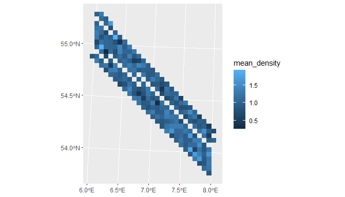
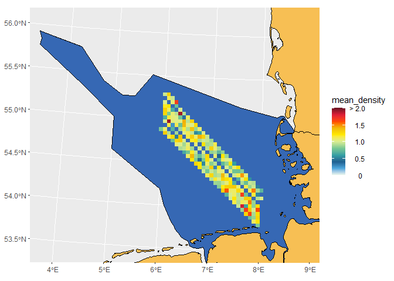

<!-- README.md is generated from README.Rmd. Please edit that file -->

# seamonas

<!-- badges: start -->
<!-- badges: end -->

The goal of seamonas is to provide tools to make plots of the North Sea

# Intro

Contains data:  
- Euring data with taxonomic grouping  
Last update: Mar-2024  
Base information from November 2023
(<https://euring.org/data-and-codes/euring-codes>)  
Except 6169 was changed to 6159.

- Data from a random generated survey in CRS 3035 and CRS 4326  
- Data from random generated densities  
- A grid generated using the function create_grid in CRS 3035

Contains functions for spatial analyses:  
- transform_survey  
- subset_grid  
- grid_densities

Contains function to plot:  
- plot_density  
- add_breaks  
- add_legend  
- add_theme

3# Installation

You can install the development version of seamonas from
[GitHub](https://github.com/) with:

``` r
# install.packages("devtools")
devtools::install_github("MiriamLL/seamonas")
```

``` r
library('seamonas')
```

# Data

Data randomly generated to simulate surveys, density data and data on
grids

## classification by euring

``` r
Euring_code<-seamonas::Code_Euring
head(Euring_code)
#>   Code     Scientific_name         English_name Artificial_tax_class
#> 1   20      Gavia stellata   Red-throated Diver               Divers
#> 2   30       Gavia arctica Black-throated Diver               Divers
#> 3   40         Gavia immer Great Northern Diver               Divers
#> 4   50       Gavia adamsii   White-billed Diver               Divers
#> 5   59         Gavia spec.   unidentified diver               Divers
#> 6   60 Podilymbus podiceps    Pied-billed Grebe               Grebes
```

## survey data

Data from a survey including longitude, latitude, timestamp

``` r
survey_4326<-survey_4326
```

``` r
head(survey_4326)
#>    seq survey_id longitude latitude          timestamps year month day
#> 1 1601         1  6.000000 55.10000 2018-04-01 09:00:00 2018    04  01
#> 2 1602         1  6.005013 55.09724 2018-04-01 09:01:00 2018    04  01
#> 3 1603         1  6.010025 55.09449 2018-04-01 09:02:00 2018    04  01
#> 4 1604         1  6.015038 55.09173 2018-04-01 09:03:00 2018    04  01
#> 5 1605         1  6.020050 55.08897 2018-04-01 09:04:00 2018    04  01
#> 6 1606         1  6.025063 55.08622 2018-04-01 09:05:00 2018    04  01
#>         date
#> 1 2018-04-01
#> 2 2018-04-01
#> 3 2018-04-01
#> 4 2018-04-01
#> 5 2018-04-01
#> 6 2018-04-01
```

``` r
ggplot2::ggplot()+
    ggplot2::geom_point(data=survey_4326,
                        ggplot2::aes(x=longitude, y= latitude, color=date),size = 1, shape = 16) 
```


## density survey

A data frame with survey data including observations, includes 2000
observations of 10 variables

``` r
density_survey<-density_survey
```

``` r
head(density_survey)
```

## density df

A data frame with survey data includes 50 observations of 10 variables

``` r
density_df<-density_df
```

``` r
head(density_df)
#>   seq survey_id longitude latitude          timestamps year month day
#> 1   1         1  6.000000 55.10000 2018-04-01 09:00:00 2018    04  01
#> 2   2         1  6.222222 54.97778 2018-04-01 09:01:00 2018    04  01
#> 3   3         1  6.444444 54.85556 2018-04-01 09:02:00 2018    04  01
#> 4   4         1  6.666667 54.73333 2018-04-01 09:03:00 2018    04  01
#> 5   5         1  6.888889 54.61111 2018-04-01 09:04:00 2018    04  01
#> 6   6         1  7.111111 54.48889 2018-04-01 09:05:00 2018    04  01
#>         date densities
#> 1 2018-04-01 3.4434922
#> 2 2018-04-01 4.0819041
#> 3 2018-04-01 0.0000000
#> 4 2018-04-01 0.1747424
#> 5 2018-04-01 0.0000000
#> 6 2018-04-01 1.5826213
```

## grid 5x5

A grid 5x5 in CRS 3035

``` r
grid5x5_3035<-grid5x5_3035
```

``` r
plot(grid5x5_3035)
```

``` r
head(grid5x5_3035)
#>                                                                                    my_grid
#> 1 3910000, 3915000, 3915000, 3910000, 3910000, 3380000, 3380000, 3385000, 3385000, 3380000
#> 2 3915000, 3920000, 3920000, 3915000, 3915000, 3380000, 3380000, 3385000, 3385000, 3380000
#> 3 3920000, 3925000, 3925000, 3920000, 3920000, 3380000, 3380000, 3385000, 3385000, 3380000
#> 4 3925000, 3930000, 3930000, 3925000, 3925000, 3380000, 3380000, 3385000, 3385000, 3380000
#> 5 3930000, 3935000, 3935000, 3930000, 3930000, 3380000, 3380000, 3385000, 3385000, 3380000
#> 6 3935000, 3940000, 3940000, 3935000, 3935000, 3380000, 3380000, 3385000, 3385000, 3380000
#>   grid_id
#> 1       1
#> 2       2
#> 3       3
#> 4       4
#> 5       5
#> 6       6
```

## surveyed grid

The surveyed grid, this means the grid cells were data was collected

``` r
grid_surveyed<-grid_surveyed
```

``` r
head(grid_surveyed)
#>     grid_identifier grid_id  n
#> 464             464     464 10
#> 531             531     531 11
#> 532             532     532  4
#> 598             598     598 12
#> 599             599     599  4
#> 600             600     600  6
#>                                                                                     geometry
#> 464 4185000, 4190000, 4190000, 4185000, 4185000, 3410000, 3410000, 3415000, 3415000, 3410000
#> 531 4180000, 4185000, 4185000, 4180000, 4180000, 3415000, 3415000, 3420000, 3420000, 3415000
#> 532 4185000, 4190000, 4190000, 4185000, 4185000, 3415000, 3415000, 3420000, 3420000, 3415000
#> 598 4175000, 4180000, 4180000, 4175000, 4175000, 3420000, 3420000, 3425000, 3425000, 3420000
#> 599 4180000, 4185000, 4185000, 4180000, 4180000, 3420000, 3420000, 3425000, 3425000, 3420000
#> 600 4185000, 4190000, 4190000, 4185000, 4185000, 3420000, 3420000, 3425000, 3425000, 3420000
```

# Survey grid

Spatial functions to transform the data

## transform_survey

A function to transform data collected in latitude and longitude from
degrees, transform from 4326 to 3035

``` r
survey_3035<-transform_survey(survey_data=survey_4326,
                 column_latitude='latitude',
                 column_longitude='longitude',
                 from_CRS=4326,
                 to_CRS=3035)
```

## subset_grid

Add values to geometries of the grid, each square is a geometry or
polygon There will be warning that variables are assumed to be spatially
constant throughout all geometries Will print a plot and return the
grids with data

``` r
grid_surveyed<-subset_grid(survey_grid=grid5x5_3035,
                      survey_data=survey_3035,
                      grid_identifier='grid_id')
```

plot to check grid

``` r
ggplot2::ggplot()+
  ggplot2::geom_sf(data = grid_surveyed, colour = "#42a921", fill= '#bde0fe',alpha=0.9)+
  ggplot2::geom_sf(data = survey_3035)+
  NULL
```


# Densities grid

A series of functions to go from a data frame of surveyed data to a grid

## transform_survey

A function to transform the CRS

``` r
densities_3035<-transform_survey(survey_data=density_survey, 
                 column_latitude='latitude',
                 column_longitude='longitude',
                 from_CRS=4326,
                 to_CRS=3035)
```

## grid_densities

A function to keep only grids with data

``` r
density_grid<-subset_density(density_survey=densities_3035,
                             column_density='densities',
                             survey_grid=grid_surveyed,
                             grid_identifier='grid_id')
```

Check the data

``` r
ggplot2::ggplot()+
  ggplot2::geom_sf(data = density_grid,mapping = ggplot2::aes(fill = mean_density), lwd = 0, colour = NA)
```



# Plots

Functions to facilitate plotting on the same style

``` r
library(sf)
#> Warning: package 'sf' was built under R version 4.2.3
#> Linking to GEOS 3.9.3, GDAL 3.5.2, PROJ 8.2.1; sf_use_s2() is TRUE
library(GermanNorthSea)
library(ggplot2)
#> Warning: package 'ggplot2' was built under R version 4.2.3
```

## Points

Base map

Define parameters, for this example the CRS **4326** is to be used.

``` r
my_CRS<-4326
Europa<-sf::st_transform(German_land, my_CRS)
EEZ<-sf::st_transform(German_EEZ, my_CRS)
color_land='#f7bf54'
color_water='#3668b4'
xval<-c(3,9)
yval<-c(53,56)
```

``` r
Base_map<-ggplot2::ggplot()+
    # maps
    ggplot2::geom_sf(data = EEZ, colour = 'black', fill = color_water)+
    ggplot2::geom_sf(data = Europa, colour = 'black', fill = color_land)+ 
    ggplot2::coord_sf(xlim = xval, ylim = yval)+

    NULL
Base_map
```


### Add dots

Data from **density_df** will be used, define shape, size and labels.

``` r
class0<-0
class1<-1
class2<-2.5
class3<-5
```

``` r
density_df<-density_df %>% 
    dplyr::mutate(density_class = dplyr::case_when(
      densities ==  class0 ~ as.character("group0"),
      densities >=  class0 & densities <=  class1 ~ as.character("group1"),
      densities >=  class1 & densities <=  class2 ~ as.character("group2"),
      densities >=  class2 & densities <=  class3 ~ as.character("group3"),
      densities >=  class3 ~ as.character("group4"),
      TRUE~"U"))
```

``` r
density_sizes<-c("group0"=0.5, "group1"=1,"group2"=2, "group3"=3, "group4"=5)
density_shapes<-c("group0"=3, "group1"=21,"group2"=21, "group3"=21, "group4"=21)
density_labels<-c('0','> 0-1','> 1-2.5','> 2.5-5','> 5')
```

``` r
density_wmap<-Base_map+
  geom_point(data=density_df,
          aes(x = longitude,
              y= latitude,
              shape = density_class,
              size= density_class),
              fill= "#d00000")+
  
  scale_shape_manual(values = density_shapes,labels=density_labels)+
  scale_size_manual(values =  density_sizes,labels=density_labels)
density_wmap
```


### add_legend

A function to add the legend inside the plot

``` r
density_wlegend<-add_legend(
  plot_wbreaks=density_wmap,
  legxy=c(0.11, 0.21))
```

``` r
density_wlegend<-density_wlegend+
  theme(legend.key.size = ggplot2::unit(0.4, "cm"))+
  ggplot2::annotate(geom="text",
                      x=3.0, y=54.0,
                      label=expression(atop("Density"), paste("[ind/k", m^2,"]")),
                      color="#343a40",hjust = 0)
density_wlegend
```


### add_theme

``` r
density_wtheme<-add_theme(plot_wlegend = density_wlegend)
density_wtheme
```


# Grid

Base data

``` r
my_CRS<-3035
Europa<-sf::st_transform(GermanNorthSea::German_land, my_CRS)
EEZ<-sf::st_transform(GermanNorthSea::German_EEZ, my_CRS)
color_land='#f7bf54'
color_water='#3668b4'
xval<-c(3910000,4250000)
yval<-c(3380000,3680000)
```

Provide density grid and mean densities

``` r
density_plot<-ggplot2::ggplot()+
    # maps
    ggplot2::geom_sf(data = EEZ, colour = 'black', fill = color_water)+
    ggplot2::geom_sf(data = Europa, colour = 'black', fill = color_land)+
    ggplot2::geom_sf(data = density_grid,
                     mapping = ggplot2::aes(fill = mean_density), lwd = 0, colour = NA) + 
  ggplot2::coord_sf(xlim = xval, ylim = yval)+

    NULL
density_plot
```


## add_breaks

A function to add color palette and breaks in the legend, will vary with
the species density estimates

``` r
add_breaks<-function(density_plot=density_plot,
                     legendbreaks=legendbreaks,
                     legendlimits=legendlimits,
                     legendlabels=legendlabels){

  plot_wbreaks<-density_plot+
    ggplot2::scale_fill_gradientn(

      colours = c("#f1faee", #0 white
                  "#4ea8de", #0.10 lightblue
                  '#1e6091', #0.20 darkblue
                  "#34a0a4", #0.30 darkgreen
                  '#76c893', #0.40 lightgreen
                  '#d9ed92', #0.50 darkyellow
                  "#ffea00", #0.60 bringyellow
                  "#f1ba0a", #0.70 organge
                  '#ff4800', #0.80 darkorgance
                  "#e01e37", #0.90 lightred
                  '#6e1423'  #1.0 darkred
      ),
      #the values are according to the size of the scale (100%), not values of the column
      values = c(0, 0.10,0.20,0.30,0.40,0.50,0.60,0.70,0.80,0.90,1.0),

      limits=legendlimits,
      breaks=legendbreaks,
      labels=legendlabels)+
    ggplot2::guides(fill = ggplot2::guide_colourbar(ticks = FALSE))
  return(plot_wbreaks)
}
```

``` r
plot_wbreaks<-add_breaks(density_plot=density_plot,
                     legendbreaks=c(0,0.5,1,1.5,2.0),
                     legendlimits=c(0,2),
                     legendlabels=c('     0','   0.5','   1.0','   1.5','> 2.0'))
plot_wbreaks
```



## add_legend

A function to add the legend inside the plot

``` r
plot_wlegend<-add_legend(
  plot_wbreaks=plot_wbreaks,
  legxy=c(0.11, 0.21))
```

``` r
plot_wlegend<-plot_wlegend+
  ggplot2::theme(legend.key.size =  ggplot2::unit(0.7, 'cm'))+
  ggplot2::annotate(geom="text",
                      x=3905000, y=3510000,
                      label=expression(atop("Density"), paste("[ind/k", m^2,"]")),
                      color="#343a40",hjust = 0)
plot_wlegend
```


## add_theme

A function to define the theme

``` r
plot_wtheme<-add_theme(plot_wlegend = plot_wlegend)
plot_wtheme
```


